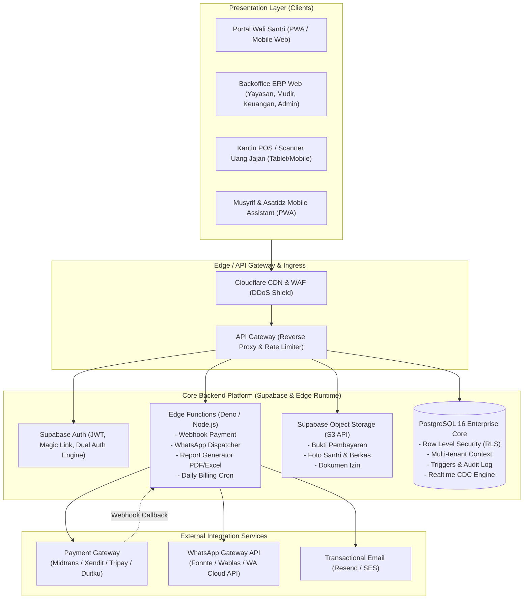
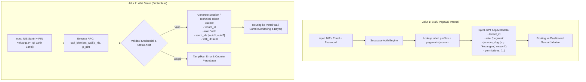
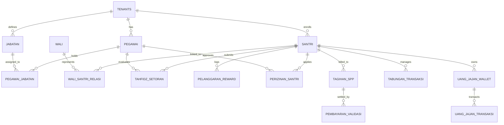
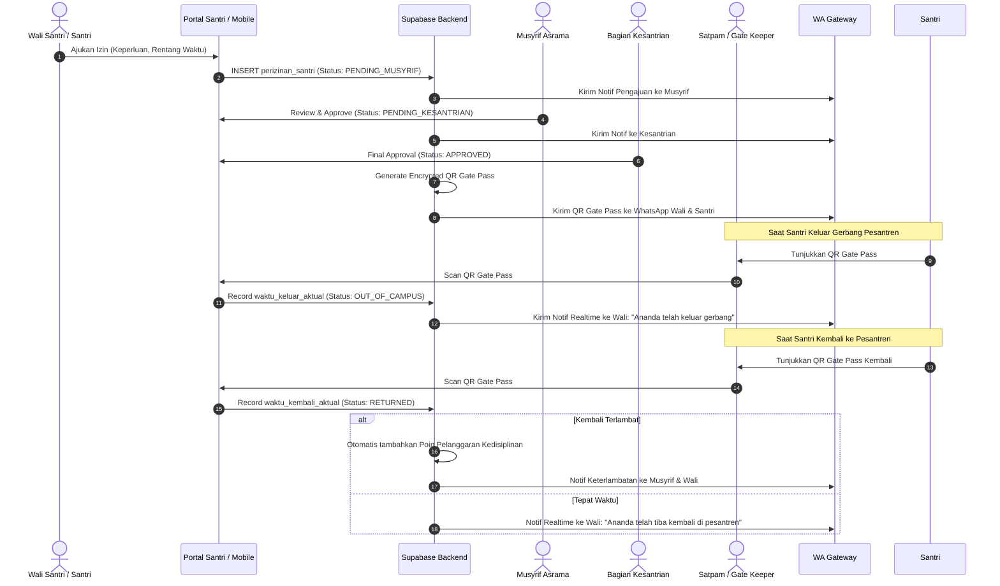
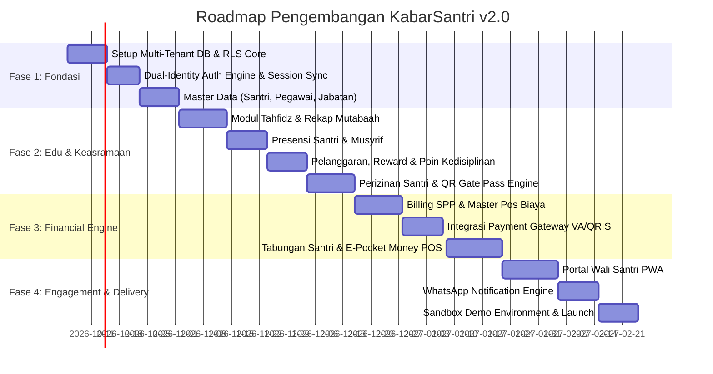

# 📐 BLUEPRINT DESAIN ARSITEKTUR KABARSANTRI ERP v2.0
**SaaS Edu-Management & Parental Engagement Platform for Pesantren**

---

## 1. EXECUTIVE SUMMARY & DESIGN PHILOSOPHY

KabarSantri v2.0 dirancang sebagai platform **B2B2C Multi-Tenant Cloud ERP** modern yang menjembatani operasional internal pesantren (manajemen yayasan, akademik, kepesantrenan/asrama, tahfidz, dan keuangan) dengan keterlibatan orang tua santri (parental engagement).

### Prinsip Utama Desain Arsitektur:
1. **Multi-Tenant Isolation by Design:** Isolasi data mutlak antar yayasan/pesantren berbasis Row Level Security (RLS) PostgreSQL dan tenant context injection pada JWT claim.
2. **Dual-Identity Authentication Gateway:** Pemisahan jalur otentikasi antara staf internal (berbasis RBAC ketat & NIP/Email) dengan wali santri (akses frictionless berbasis identitas santri & PIN/OTP).
3. **No Role Picking by User:** Hak akses dan dashboard ditentukan secara deterministik oleh sistem berdasarkan relasi `user -> profil -> pegawai -> jabatan`.
4. **Financial Immutability & Audit Trail:** Seluruh transaksi keuangan (SPP, Tabungan, Uang Jajan/Pocket Money, Donasi) menggunakan pendekatan pembukuan buku besar (ledger) tanpa *hard delete*.
5. **Sandbox & Production Separation:** Tenant Demo beroperasi di lingkungan terisolasi dengan data sintetis dan tidak memiliki akses ke database produksi.
6. **Mobile-First & Low-Bandwidth Resilience:** UI responsif (PWA) yang ringan untuk mengakomodasi koneksi internet di lingkungan pondok pesantren pedesaan.

---

## 2. HIGH-LEVEL SYSTEM ARCHITECTURE (C4 CONTAINER LEVEL)



---

## 3. MULTI-TENANCY & DATA ISOLATION MODEL

### 3.1 Model Isolasi: Shared Database, Tenant Discriminator with RLS
- Setiap tabel operasional memiliki kolom wajib: `tenant_id UUID NOT NULL REFERENCES tenants(id)`.
- Enkapsulasi isolasi dilakukan di level PostgreSQL kernel menggunakan **Row Level Security (RLS)**.

```sql
-- Contoh Definisi Tenant Enforcing Function
CREATE OR REPLACE FUNCTION current_tenant_id() 
RETURNS uuid AS $$
  SELECT NULLIF(current_setting('request.jwt.claims', true)::jsonb -> 'app_metadata' ->> 'tenant_id', '')::uuid;
$$ LANGUAGE sql STABLE;

-- Kebijakan RLS Global Otomatis
CREATE POLICY tenant_isolation_policy ON santri
  FOR ALL
  USING (tenant_id = current_tenant_id())
  WITH CHECK (tenant_id = current_tenant_id());
```

### 3.2 Tenant Hierarchy
```text
KabarSantri Platform (SaaS Root)
   └── Tenant (Yayasan / Lembaga Induk)
         ├── Unit Pendidikan 1: Pondok Pesantren Tahfidz
         │     ├── Asrama / Kamar
         │     └── Halaqah Tahfidz
         ├── Unit Pendidikan 2: SMP Islam Terpadu / MTs
         │     └── Kelas & Rombel Formal
         └── Unit Pendidikan 3: SMA Islam Terpadu / MA
               └── Kelas & Jurusan
```

### 3.3 Production vs Demo Sandbox Isolation Strategy
| Dimensi | Production Tenant | Demo / Sandbox Tenant |
| :--- | :--- | :--- |
| `tenants.type` | `'production'` | `'demo'` |
| Payment Gateway | Production Keys (Live VA/QRIS) | Mock Gateway / Sandbox Sandbox Simulator |
| WA Notification | Gateway Live (Mengirim pesan ke No HP asli) | Mock WA Logger (Tercatat di DB saja tanpa kirim WA) |
| Lifecycle Data | Permanen & di-backup berkala | Scheduled Reset (Di-reset otomatis tiap 24 jam via Cron) |
| Read/Write Access | Read/Write dengan audit trail ketat | Read/Write di namespace `demo_tenant_id` terisolasi |

---

## 4. DUAL-IDENTITY AUTHENTICATION & ACCESS ENGINE

Sistem menerapkan dua gerbang otentikasi terpisah untuk menghindari celah keamanan, salah penugasan role, dan friksi registrasi bagi wali santri.



### 4.1 Mekanisme "No Role Picking by User"
- Pengguna tidak pernah memilih "Saya login sebagai Guru/Keuangan".
- Jabatan dan wewenang bersifat **relasional**:
  $$\text{User ID} \longrightarrow \text{Profil} \longrightarrow \text{Pegawai} \longrightarrow \text{Pegawai\_Jabatan} \longrightarrow \text{Jabatan} \longrightarrow \text{Permission Matrix}$$
- Apabila pegawai memiliki mutasi jabatan, admin yayasan cukup memperbarui relasi jabatan di master pegawai; token berikutnya otomatis menyesuaikan menu dashboard.

---

## 5. CORE DOMAIN MODEL & DATABASE ARCHITECTURE

### 5.1 Skema Inti & Entity Relationship
Skema PostgreSQL dibagi dalam 6 Domain Module:



### 5.2 Rincian Modul Database Utama

#### A. Master Data & Identitas
1. `tenants`: Menyimpan identitas yayasan, subdomain/custom domain, logo, status lisensi, konfigurasi payment & WhatsApp gateway.
2. `units`: Unit pendidikan (Tahfidz, MTs, MA, Pesantren Putra, Pesantren Putri).
3. `profiles`: Data akun pengguna auth Supabase (`id`, `tenant_id`, `email`, `nama`, `avatar_url`).
4. `pegawai`: Profil staf/asatidz (`nip`, `nik`, `status_aktif`, `tanggal_bergabung`).
5. `jabatan`: Daftar jabatan sistematis (`slug`: `yayasan`, `mudir`, `guru`, `kesantrian`, `musyrif`, `keuangan`, `admin`).
6. `santri`: Data induk santri (`nis`, `nisn`, `nama_lengkap`, `tempat_lahir`, `tanggal_lahir`, `kamar_id`, `kelas_id`, `status`: `'aktif'|'alumni'|'mutasi'`).
7. `wali`: Profil wali santri (`nama_wali`, `no_whatsapp`, `hubungan`, `pin_hash`).
8. `wali_santri_relasi`: Relasi $N:M$ antara wali dan santri (1 wali dapat memiliki 2 atau lebih anak di pesantren yang sama).

#### B. Modul Akademik & Keasramaan
1. `tahfidz_setoran`:
   - `santri_id`, `musyrif_id`, `jenis`: `'ziyadah' | 'murajaah_harian' | 'murajaah_akbar' | 'tasmi'`.
   - `juz`, `surah_awal`, `surah_akhir`, `ayat_awal`, `ayat_akhir`.
   - `kelancaran_skor` (1-100), `tajwid_skor` (1-100), `makhraj_skor` (1-100), `catatan`, `status_kelulusan`.
2. `presensi_santri`:
   - `santri_id`, `sesi`: `'subuh' | 'kbm_pagi' | 'ashar' | 'maghrib_halaqah' | 'isya' | 'tidur_malam'`.
   - `tanggal`, `status`: `'hadir' | 'izin' | 'sakit' | 'alpa' | 'tugas'`.
3. `presensi_pegawai`:
   - `pegawai_id`, `waktu_masuk`, `waktu_pulang`, `lat_long_in`, `lat_long_out`, `swafoto_url`.
4. `pelanggaran_reward`:
   - `santri_id`, `pencatat_id`, `tipe`: `'pelanggaran' | 'reward'`.
   - `kategori`: `'kedisiplinan' | 'akhlak' | 'kebersihan' | 'ibadah'`.
   - `poin` (+/-), `tindakan_hukuman`, `status_penyelesaian`, `lampiran_bukti`.
5. `perizinan_santri`:
   - `santri_id`, `pemohon_type`: `'wali' | 'santri' | 'internal'`.
   - `waktu_keluar_rencana`, `waktu_kembali_rencana`.
   - `approval_musyrif` (status, approver_id, waktu).
   - `approval_kesantrian` (status, approver_id, waktu).
   - `barcode_gate_pass` (unique hash).
   - `waktu_keluar_aktual`, `waktu_kembali_aktual`, `status_kedatangan`: `'tepat_waktu' | 'terlambat'`.

#### C. Modul Keuangan Pesantren (Financial Engine)
1. `pos_biaya`: Master pos tagihan (`SPP`, `Uang Gedung`, `Daftar Ulang`, `Uang Buku`, `Catering`).
2. `tagihan_santri`:
   - `santri_id`, `pos_biaya_id`, `periode_bulan`, `periode_tahun`, `nominal_tagihan`, `nominal_terbayar`, `status`: `'unpaid' | 'partial' | 'paid' | 'cancelled'`.
3. `pembayaran`:
   - `no_transaksi`, `tagihan_id`, `metode_pembayaran`: `'payment_gateway' | 'transfer_manual' | 'tunai_kantor'`.
   - `nominal`, `kode_unik`, `channel`: `'qris' | 'bca_va' | 'bni_va' | 'mandiri_va'`.
   - `status`: `'pending' | 'success' | 'failed' | 'expired'`.
   - `signature_webhook`, `idempotency_key`.
4. `tabungan_rekening` & `tabungan_transaksi`:
   - Rekening simpanan wadiah santri.
   - Mutasi debet/kredit dengan pencatatan saldo berjalan (*running balance*).
5. `uang_jajan_wallet` & `uang_jajan_transaksi`:
   - Dompet digital internal santri untuk transaksi di kantin/koperasi pesantren.
   - `limit_harian`: diatur oleh wali santri via Portal Wali.
   - PIN santri / Barcode kartu santri fisik.
   - Mencegah santri memegang uang tunai berlebih dan melatih literasi finansial santri.
6. `donasi_infaq`:
   - Program donasi/wakaf pembangunan pondok, pembebasan tanah, atau santunan anak yatim.

---

## 6. BUSINESS WORKFLOW & INTEGRATION ARCHITECTURE

### 6.1 Alur Perizinan Santri Berbasis Barcode Gate Pass


### 6.2 Alur Integrasi Pembayaran Otomatis & Rekonsiliasi
1. **Invoice Generated:** Sistem men-generate tagihan SPP rutin tanggal 1 setiap bulan via Edge Cron.
2. **Parent Opens Portal:** Wali santri melihat tagihan dan menekan tombol *Bayar Sekarang*.
3. **PG Charge Request:** Edge Function memanggil Payment Gateway API (Xendit/Midtrans/Duitku) untuk menerbitkan Virtual Account (VA) atau QRIS dinamis.
4. **Payment Execution:** Wali mentransfer dana via Mobile Banking atau scan QRIS.
5. **Webhook Callback:**
   - Gateway mengirim HTTP POST payload ke Edge Function `/webhook/payment`.
   - Edge function memvalidasi signature header (HMAC SHA256/SHA512) & idempotency key.
   - Transaksi database dijalankan dalam block `BEGIN ... COMMIT`:
     - Update status `pembayaran` $\to$ `success`.
     - Update `tagihan_santri.nominal_terbayar` & status $\to$ `paid`.
     - Catat jurnal kas di `keuangan_ledger`.
   - Trigger Edge Function untuk mengirim **Kuitansi Resmi Digital via WhatsApp** ke nomor wali.

### 6.3 Alur Uang Jajan Digital (E-Pocket Canteen Flow)
1. **Top-Up:** Wali santri mengisi saldo dompet saku santri via Portal Wali (Payment Gateway).
2. **Limit Kontrol:** Wali dapat menetapkan batas jajan maksimal (contoh: Rp 20.000 / hari).
3. **Transaksi Kantin:**
   - Santri bertransaksi di kantin pondok dengan scan Kartu Barcode/RFID Santri atau menyebutkan NIS + PIN.
   - POS Kantin mengecek: (1) Sisa saldo wallet $\ge$ total belanja, (2) Belanja hari ini belum melebihi limit harian wali.
   - Saldo dompet terpotong seketika.
4. **Monitoring:** Wali menerima rekapan jajan santri di menu tabungan portal wali.

---

## 7. DATA RETENTION, SOFT-DELETE & AUDIT TRAIL POLICY

### 7.1 Kebijakan Larangan Hard Delete
Tabel-tabel berikut **DILARANG MENGGUNAKAN HARD DELETE (`DELETE FROM`)**:
- `santri` & `pegawai` (Menggunakan kolom `status`, `deleted_at`, `deleted_by`).
- Seluruh tabel finansial (`tagihan_santri`, `pembayaran`, `tabungan_transaksi`, `uang_jajan_transaksi`). Koreksi salah input wajib melalui mekanisme **Storno / Reversal Transaction**.
- `tahfidz_setoran` & `pelanggaran_reward` (Data historis perilaku dan capaian spiritual).

### 7.2 Generic Audit Logging Engine
Setiap mutasi (INSERT, UPDATE, DELETE) pada tabel sensitif dimonitor oleh trigger PostgreSQL yang menuliskan event ke tabel `audit_logs`:
```sql
CREATE TABLE audit_logs (
    id UUID PRIMARY KEY DEFAULT gen_random_uuid(),
    tenant_id UUID NOT NULL,
    table_name VARCHAR(64) NOT NULL,
    record_id UUID NOT NULL,
    action VARCHAR(10) NOT NULL, -- 'INSERT', 'UPDATE', 'DELETE'
    old_data JSONB NULL,
    new_data JSONB NULL,
    performed_by UUID NULL REFERENCES profiles(id),
    ip_address INET NULL,
    user_agent TEXT NULL,
    created_at TIMESTAMPTZ DEFAULT now()
);
```

---

## 8. ROLE-BASED ACCESS CONTROL (RBAC) PERMISSION MATRIX

| Modul / Fitur | Yayasan | Mudir / Kepsek | Guru / Asatidz | Kesantrian | Musyrif | Keuangan | Wali Santri |
| :--- | :---: | :---: | :---: | :---: | :---: | :---: | :---: |
| **Master Pegawai & Jabatan** | Full | View Only | No Access | No Access | No Access | No Access | No Access |
| **Master Santri & Kelas** | Full | Full | View (Kelas) | Full | View (Kamar) | View | No Access |
| **Tahfidz & Setoran** | View | View / Laporan | Input (KBM) | View | Full (Halaqah) | No Access | View (Anak Sendiri) |
| **Presensi KBM** | View | View | Full | View | No Access | No Access | View (Anak Sendiri) |
| **Presensi Asrama & Sholat**| View | View | No Access | Full | Full | No Access | View (Anak Sendiri) |
| **Pelanggaran & Reward** | View | View | Input Catatan | Full Wewenang | Input Catatan | No Access | View (Anak Sendiri) |
| **Perizinan Santri** | View | View | No Access | Approval Final | Approval Tahap 1| No Access | Pengajuan & QR Pass |
| **SPP & Tagihan Biaya** | View | View | No Access | No Access | No Access | Full Wewenang | Bayar & Download Nota |
| **Tabungan Santri** | View | View | No Access | No Access | No Access | Full Wewenang | View & Topup |
| **Uang Jajan / Kantin POS** | View | View | No Access | No Access | No Access | Kasir / Laporan | Atur Limit & Topup |
| **Laporan Eksekutif / Keuangan**| Full | Laporan Lembaga | No Access | No Access | No Access | Laporan Kasir | No Access |

---

## 9. NON-FUNCTIONAL REQUIREMENTS & DEVOPS INFRASTRUCTURE

### 9.1 Tech Stack Standard v2.0
- **Frontend Core:** Next.js 14+ (App Router, React Server Components, TypeScript, Tailwind CSS, Shadcn UI).
- **Mobile/PWA:** Progressive Web App dengan Service Workers & Offline Caching untuk Musyrif saat mencatat tahfidz di masjid tanpa sinyal kuat.
- **Backend & Database:** Supabase Cloud / Self-hosted Supabase Enterprise (PostgreSQL 16, Auth, Realtime WebSocket, Storage).
- **Serverless Compute:** Supabase Edge Functions (Deno/TypeScript) untuk integrasi webhook dan third-party.
- **Notification Queue:** Upstash Redis / PostgreSQL pgmq untuk antrian pengiriman pesan WhatsApp agar terhindar dari pemblokiran rate limit.

### 9.2 Keamanan & Standar Kepatuhan
1. **Enkripsi Data:** TLS 1.3 in-transit, AES-256 at-rest untuk berkas di Supabase Storage.
2. **PIN Hashing:** PIN Wali Santri dan PIN Kasir Kantin di-hash menggunakan `Argon2id` atau `bcrypt`.
3. **Session Expiry:**
   - Staf internal: Token refresh 1 jam, inactivity timeout 8 jam.
   - Portal Wali: Session persist hingga 30 hari untuk kenyamanan orang tua santri.
4. **Rate Limiting:** Proteksi login brute-force pada endpoint `cari_identitas_wali` maksimal 5 percobaan per menit per IP address.

---

## 10. ROADMAP IMPLEMENTASI TAHAP v2.0


