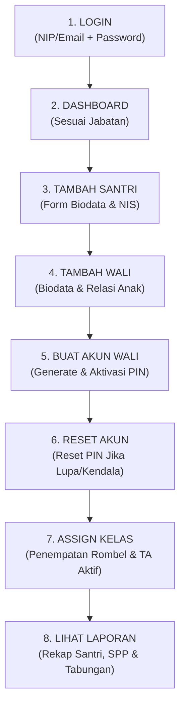

# 🔄 PANDUAN WORKFLOW OPERASIONAL & SECURITY PIPELINE KABARSANTRI v2.0

Dokumen ini memetakan implementasi konkret dari siklus arsitektur, security isolation, dan operational admin journey yang diturunkan dari pembelajaran KabarSantri v1 menuju standard v2.0.

---

## 1. PEMETAAN 8-STAGE ARCHITECTURAL PIPELINE

```text
Tenant
   ↓
Identity
   ↓
Profile
   ↓
Role / Jabatan
   ↓
Permission
   ↓
Master Data
   ↓
Transaction
   ↓
Reporting
```

| Tahapan | Entitas Database / Modul | Deskripsi Operasional & Teknis |
| :--- | :--- | :--- |
| **1. Tenant** | `tenants` | Isolasi yayasan/lembaga induk. Menentukan subdomain, batas lisensi, dan `feature_flags`. |
| **2. Identity** | `auth.users` (Supabase) | Kredensial teknis otentikasi (Email/NIP untuk staf internal, Technical JWT untuk wali). |
| **3. Profile** | `profiles` | Data dasar akun pengguna (`nama_lengkap`, `no_hp`, `avatar_url`, `status`). |
| **4. Role/Jabatan**| `pegawai_jabatan` $\to$ `jabatan` | **Role bukan dipilih oleh user**. Ditentukan secara relasional dari SK jabatan internal. |
| **5. Permission** | `jabatan.permissions` | Wewenang granular (misal: `santri.create`, `spp.validate`, `laporan.view`). |
| **6. Master Data** | `santri`, `wali`, `unit`, `kelas` | Data pokok operasional pendidikan dan kepesantrenan. |
| **7. Transaction** | `tagihan_spp`, `tabungan`, `uang_jajan` | Transaksi riil dengan prinsip mutasi buku besar (*ledger*) & *no hard delete*. |
| **8. Reporting** | `rpc_get_laporan_ringkasan()` | Agregasi data real-time untuk pengambil keputusan (Yayasan, Mudir, Bendahara). |

---

## 2. 4-LAYER SECURITY & ISOLATION CASCADE

```text
tenant_id
    ↓
RLS (Row Level Security)
    ↓
Role Authorization
    ↓
CRUD Policy
```

1. **`tenant_id` Injection:** Setiap request membawa claims JWT yang memuat `app_metadata.tenant_id`.
2. **RLS (PostgreSQL Kernel):** Query database di-filter secara otomatis menggunakan policy:
   ```sql
   USING (tenant_id = current_tenant_id())
   ```
   Data antar yayasan tidak akan pernah bocor meskipun terjadi celah di level aplikasi.
3. **Role Authorization:** Sistem memverifikasi wewenang user berdasarkan slug jabatan yang aktif (`yayasan`, `keuangan`, `musyrif`, dll).
4. **CRUD Policy:** Kebijakan operasi data:
   - SELECT: Sesuai scope jabatan.
   - INSERT/UPDATE: Divalidasi oleh constraints & business rules.
   - DELETE: **Dilarang untuk data finansial dan riwayat santri**; dialihkan ke mekanisme soft-delete (`deleted_at`) atau transaksi *storno/reversal*.

---

## 3. ADMIN OPERATIONAL JOURNEY (STEP-BY-STEP)

Alur kerja harian staf tata usaha / kesiswaan di KabarSantri v2.0:



### Langkah 1: LOGIN (Dual-Auth Resolution)
- Staf menginput NIP/Email + Password.
- Sistem memvalidasi via Supabase Auth dan secara otomatis menarik data profil & jabatan.
- Dashboard ter-render sesuai hak akses tanpa meminta staf memilih role secara manual.

### Langkah 2: DASHBOARD
- Menampilkan metrik utama sesuai jabatan:
  - Staf Kesiswaan: Jumlah santri aktif, santri baru belum berkelas.
  - Bendahara/Keuangan: Tagihan SPP tertagih vs tertunggak.
  - Yayasan/Mudir: Ringkasan menyeluruh lintas unit.

### Langkah 3: TAMBAH SANTRI
- Menu: `Kesiswaan > Tambah Santri`.
- Input: NIS, NISN, Nama Lengkap, Jenis Kelamin, Tanggal Lahir, Unit Pendidikan.
- **Underlying Engine:**
  - Record santri dibuat dengan status `aktif`.
  - Secara otomatis menyiapkan rekening `tabungan_santri` (Wadiah).
  - Secara otomatis menginisialisasi `uang_jajan_wallet` (Saldo Rp 0, Limit Harian Rp 20.000).

### Langkah 4: TAMBAH WALI
- Menu: `Kesiswaan > Tambah Wali`.
- Input: Nama Lengkap Wali, No WhatsApp (valid untuk integrasi WA Gateway), Alamat, dan Hubungan (Ayah/Ibu/Wali).
- Relasikan dengan santri yang bersangkutan (`wali_santri_relasi`). Mendukung relasi 1 wali dengan banyak santri (kakak-beradik).

### Langkah 5: BUAT AKUN WALI
- Menu: `Wali Santri > Buat Akun Wali`.
- Operator memilih wali santri yang baru didaftarkan, lalu menekan **"Aktivasi Akun"**.
- Sistem menjalankan RPC `rpc_buat_akun_wali(p_wali_id, p_initial_pin)`:
  - Men-generate PIN unik (atau operator menginput PIN default 6 digit).
  - Hashing PIN menggunakan bcrypt/blowfish.
  - Mengirimkan pesan selamat datang dan kredensial PIN ke nomor WhatsApp wali santri.

### Langkah 6: RESET AKUN WALI
- Menu: `Wali Santri > Aksi > Reset PIN`.
- Digunakan saat wali santri lupa PIN atau nomor telepon berpindah tangan.
- Operator menekan tombol reset $\to$ sistem menjalankan RPC `rpc_reset_akun_wali(p_wali_id, p_new_pin)` $\to$ notifikasi PIN baru terkirim otomatis ke WhatsApp wali.

### Langkah 7: ASSIGN KELAS
- Menu: `Kesiswaan > Assign Kelas & Rombel`.
- Pilih Tahun Ajaran Aktif (misal: 2026/2027 Ganjil), Unit (misal: MTs Putra), dan Kelas (misal: 7A).
- Pilih satu atau beberapa santri yang belum memiliki rombel, lalu klik **"Tempatkan di Kelas"**.
- Sistem memanggil RPC `rpc_assign_santri_kelas(santri_id, kelas_id, tahun_ajaran_id)`.

### Langkah 8: LIHAT LAPORAN
- Menu: `Laporan Eksekutif > Ringkasan Eksekutif`.
- Sistem memanggil RPC `rpc_get_laporan_ringkasan()` untuk menyajikan:
  - Jumlah total santri aktif per jenjang.
  - Jumlah guru & musyrif aktif.
  - Rekapitulasi SPP: Total Terbayar vs Total Piutang/Tertunggak.
  - Total Saldo Tabungan Santri.

---

## 4. PENERAPAN KHUSUS: MODUL UANG JAJAN (E-POCKET KANTIN)

> [!IMPORTANT]
> **Aturan Bisnis:** Modul Uang Jajan tetap dibuat implementasinya secara menyeluruh (database, RPC, service, logic validasi saldo & limit harian), **tetapi disembunyikan terlebih dahulu di antarmuka navigasi UI**.

### 4.1 Implementasi Teknis yang Tetap Berjalan:
1. **Database:** Tabel `uang_jajan_wallet` dan `uang_jajan_transaksi` telah siap di skema database dengan constraints saldo $\ge 0$.
2. **Business RPC:** Fungsi PostgreSQL `rpc_uang_jajan_belanja(p_santri_id, p_nominal, p_keterangan)` lengkap dengan baris penguncian `FOR UPDATE` guna menangkal *race condition / double spending* dan pembatasan limit harian belanja santri.
3. **TypeScript Service:** File [`src/services/finance.service.ts`](file:///c:/Users/BUNDA/Downloads/kabarsantriv2/src/services/finance.service.ts) menyediakan method `getWalletUangJajan()`, `topUpUangJajan()`, `aturLimitHarianUangJajan()`, dan `uangJajanBelanja()`.

### 4.2 Mekanisme Penyembunyian di UI:
- Dikendalikan melalui modul feature flags [`src/config/features.ts`](file:///c:/Users/BUNDA/Downloads/kabarsantriv2/src/config/features.ts):
  ```typescript
  export const DEFAULT_FEATURE_FLAGS = {
    enable_uang_jajan: false, // Default false: disembunyikan di UI
    enable_tahfidz: true,
    enable_perizinan: true,
    enable_pelanggaran_reward: true,
  };
  ```
- Navigasi sidebar pada [`src/config/navigation.ts`](file:///c:/Users/BUNDA/Downloads/kabarsantriv2/src/config/navigation.ts) secara otomatis mengecualikan menu "Uang Jajan Santri" saat fungsi `getFilteredNavigation()` dipanggil oleh komponen UI:
  ```typescript
  { 
    title: 'Uang Jajan Santri (Kantin)', 
    href: '/finance/uang-jajan', 
    featureFlag: 'enable_uang_jajan', // Difilter keluar jika flag bernilai false
  }
  ```
- **Cara Mengaktifkan di Masa Depan:** Cukup ubah nilai `enable_uang_jajan: true` di database `tenants.feature_flags` atau konfigurasi aplikasi tanpa perlu merombak ulang kode apapun.
